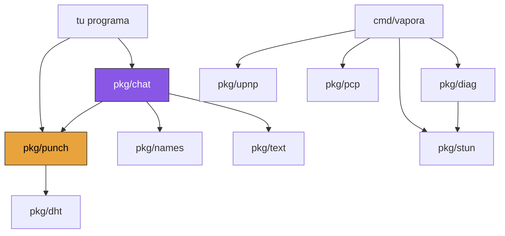

```
█▀▀▀▄ █   █ ▀▀█▀▀ █     █▀▀▀▄ ▀▀█▀▀ █▄  █ ▄▀▀▀▄
█▄▄▄▀ █   █   █   █     █   █   █   █▀▄ █ █  ▄▄
█   █ █   █   █   █     █   █   █   █  ██ █   █
▀▀▀▀   ▀▀▀  ▀▀▀▀▀ ▀▀▀▀▀ ▀▀▀▀  ▀▀▀▀▀ ▀   ▀  ▀▀▀
      ▄▀▀▀▄ █   █   ▀▀█▀▀ █   █ ▀▀█▀▀ ▄▀▀▀▄
      █   █ █▄  █     █   █▄▄▄█   █   █
      █   █ █  ██     █   █   █   █    ▀▀▄
       ▀▀▀  ▀   ▀     ▀   ▀   ▀ ▀▀▀▀▀ ▀▀▀▀
```

[English](ARCHITECTURE.md) · **Español**

**Cómo se construye el canal, y cómo usarlo para algo que no es un chat.**

← [volver al README](README.es.md)

---

## La forma de todo esto

```
        ┌──────────────────────────────────────────────┐
        │  tu programa                                 │   bytes adentro y afuera
        ├──────────────────────────────────────────────┤
        │  pkg/chat     líneas · tipeo · hablantes     │   un consumidor posible
        │  pkg/names    clave → "CRIMSON OTTER"        │
        ├──────────────────────────────────────────────┤
        │  pkg/punch    el camino · claves · la malla  │   ← el transporte
        ├───────────────┬───────────────┬──────────────┤
        │  pkg/stun     │  pkg/upnp     │  pkg/dht     │   encontrar tu dirección
        │  dónde estoy  │  pkg/pcp      │  encontrarte │   y abrir puertas
        └───────────────┴───────────────┴──────────────┘
                              ↓
                        un socket UDP
```

Un socket, un binding de NAT, un keepalive. Todo lo de arriba lo comparte, y por
eso `pkg/punch` nunca lo lee directamente — lo hace `Mux`, y reparte los
datagramas.

**Dependencias:** la biblioteca estándar. Esa es la lista completa.



`pkg/punch` depende de `pkg/dht` y de nada más. Fijate en lo que **no** está: el
transporte no importa `pkg/text` ni `pkg/names`, porque no tiene opinión sobre
qué significan los bytes.

---

## El problema, en un diagrama

Tu máquina no tiene dirección propia. La tiene tu router, y todo lo de tu casa la
comparte. Así que el primer paquete de un desconocido llega a una puerta sin
nombre, y se descarta.

```
      vos                     internet                      la otra persona
  ┌─────────┐                                            ┌─────────┐
  │ 10.0.0.4│───┐                                    ┌───│10.0.0.9 │
  └─────────┘   │                                    │   └─────────┘
             ┌──▼───┐                            ┌───▼──┐
             │router│  ✗ ──── primer paquete ──  │router│
             └──┬───┘         muere acá          └───┬──┘
        203.0.113.7:41001                    198.51.100.4:52000
```

**La solución:** los dos lados mandan *hacia afuera* en el mismo momento. Cada
router ve un paquete saliente, abre un agujero para la respuesta, y los dos
agujeros se alinean.

```
             ┌──────┐                            ┌──────┐
             │router│ ──── ▶      ◀ ──────────── │router│
             └──────┘   los dos perforan a la vez└──────┘
                        ✓ el camino quedó abierto
```

Ese "al mismo momento" es toda la dificultad, y todo lo que sigue existe para
organizarlo.

---

## Paso 1 · ¿Dónde estoy? — `pkg/stun`

No podés invitar a nadie a ningún lado hasta saber qué ve el mundo.

```go
conn, _ := net.ListenUDP("udp4", &net.UDPAddr{})

watcher := stun.NewWatcher(stun.DefaultServers, stun.DefaultKeepalive)
endpoint, err := watcher.Wait(ctx, 10*time.Second)   // 203.0.113.7:41001
```

`Watcher` sigue preguntando, así que también nota cuando tu dirección **cambia**
— cambiás de wifi y la invitación que compartiste está muerta:

```go
watcher.OnChange(func(antes, ahora *net.UDPAddr) { /* compartir una nueva */ })
```

Además clasifica tu router, que es lo que decide si una conexión es posible:

| | Qué significa |
|---|---|
| **Mapping** | ¿Tu dirección es la misma para cada destino? *Endpoint-independent* ("cone") significa que sí. *Address-dependent* ("symmetric") significa que a nadie se le puede decir a dónde apuntar. |
| **Filtering** | ¿Quién puede mandarte un primer paquete? *Endpoint-independent* es abierto. *Port-dependent* significa que solo quien vos contactaste primero. |

```go
report, _ := stun.Probe(ctx, stun.DefaultServers, 4*time.Second)
report.Mapping     // stun.MappingEndpointIndependent
report.Filtering   // stun.FilteringAddressAndPortDependent
```

<sup>RFC 5389 para la consulta, RFC 5780 para la clasificación.</sup>

---

## Paso 2 · ¿Estos dos pueden encontrarse? — `pkg/diag`

La conectividad es una propiedad del **par**. Ninguna medición de un solo lado la
responde, y por eso el perfil está hecho para pegárselo a otra persona.

```go
mine  := diag.Profile{Mapping: report.Mapping, Filtering: report.Filtering}
mine.Code()                       // "CONE-PORT-18"  ← mandale esto

theirs, _ := diag.ParseProfile("CONE-OPEN-64")
advice := diag.Pair(mine, theirs)

advice.Works      // true
advice.Invites    // 1 — o 2 cuando ninguno acepta un primer paquete
advice.Publisher  // "them" — el lado que tiene que ser el que espera
```

Para un grupo, todos los pares a la vez — y una sala puede estar **parcialmente**
rota, algo que ninguna respuesta de a dos puede expresar:

```go
mesh := diag.MeshOf([]diag.Member{{Name: "ana", Profile: mine}, ...})
mesh.Closes      // false
mesh.Broken      // [{ana, caro, "los dos reparten un puerto nuevo por destino..."}]
mesh.Isolated    // ["caro"] — va a quedar mirando lo que parece una sala vacía
mesh.Hosts       // ["ana","beto"] — varios es una respuesta real, no una faltante
```

---

## Paso 3 · Pedirle al router por las buenas — `pkg/upnp`, `pkg/pcp`

Opcional, y falla seguido. Los routers hablan tres idiomas distintos para "abrí
una puerta", rara vez coinciden en cuál, y muchos dicen que sí y no lo hacen.

```go
gateway, _ := upnp.Discover(ctx, 3*time.Second)          // multicast SSDP
external, _ := gateway.ExternalIP(ctx)
gateway.AddPortMapping(ctx, "UDP", 41000, 41000, "vapora", time.Hour)

client, _ := pcp.Dial(gatewayIP)                         // netip.Addr
version, _ := client.Detect(ctx)                         // PCP, si no NAT-PMP
mapping, _ := client.Map(ctx, pcp.MapRequest{...})
```

Dos cosas que vale saber, las dos aprendidas a los golpes:

- **Publicá la dirección que observó STUN, nunca la que pediste.** Detrás de
  doble NAT, el puerto externo de un mapeo UPnP vive en una dirección WAN
  *privada*, y no es a la que un par en internet puede marcar.
- **Un lease de mapeo no es un agujero.** El lease gobierna el router interno; el
  NAT más externo igual expira su binding por inactividad. El lado que espera
  tiene que seguir mandando de todas formas.

---

## Paso 4 · Abrir el camino — `pkg/punch`

Cuatro piezas. La primera es la única que lee el socket.

```
  ┌─────────┐  datagrama  ┌─────────┐  ruteado por dirección ┌─────────┐
  │  socket │ ──────────▶ │   Mux   │ ─────────────────────▶ │ Session │
  └─────────┘             └────┬────┘                        └─────────┘
                               │  ¿sin ruta? probá cada fallback en orden
                               ▼
                    watcher → greeter → sesiones → DHT
```

```go
mux := punch.NewMux(conn)
go mux.Run(ctx)                                   // el único ReadFromUDP

mux.Fallback(punch.SinkFunc(watcher.Handle))      // respuestas de STUN
mux.Fallback(session)                             // cualquier cosa que autentique
```

**Las sesiones nunca leen.** Reciben datagramas y mandan. Eso es lo que permite
que un solo socket lleve STUN, siete pares y un cliente DHT a la vez.

### El handshake

```
   joiner                                                     inviter
      │                                                          │
      │  ── punch ────────────────────────────▶ (descartado)     │   el router
      │  ── punch ─────────────────────────────────▶ ✓           │   se abre
      │                                                          │
      │  ◀───────────────────────────────────── ack ──           │
      │                                                          │
      ├─────────── camino abierto, en ambas direcciones ─────────┤
      │                                                          │
      │  ── ping (relleno de largo variable) ─────▶              │
      │  ◀──────────────── pong (con relleno propio) ─           │   vitalidad
      │                                                          │
      │  ── data ────────────────────────────────▶               │   tus bytes
```

```go
codec, _ := punch.NewSecretCodec(secret, punch.RoleInviter)
session := punch.NewSession(mux, codec, nil)
mux.Fallback(session)

session.Observe(punch.ObserverFunc(func(payload []byte) {
    // exactamente los bytes que mandó el par. Nada verificado, nada saneado:
    // qué es seguro depende enteramente de qué vas a hacer con ellos.
}))

go session.Run(ctx)                          // keepalive y vitalidad
session.Open(ctx, 3*time.Minute)             // perforar hasta que llegue el ack
session.Send([]byte("lo que sea"))
```

**El ping lleva relleno de largo variable**, y el pong rellena por su cuenta, así
que ninguno de los dos es reconocible por su tamaño. Una sonda silenciosa que se
nota que es una sonda no es una sonda silenciosa.

### Cómo se ve en la red

```
  ┌──────────┬─────────────┬──────────────────────────────────┐
  │ nonce    │ kind        │ payload (cifrado, AES-256-GCM)   │
  │ 4 + 8 B  │ 1 B         │                                  │
  └──────────┴─────────────┴──────────────────────────────────┘
       │            │
       │            └── < 0x40 : del transporte (punch/ack/ping/pong/bye)
       │                  0x40 : punch.AppKind — tuyo, nunca interpretado
       │
       └── 4 bytes aleatorios por proceso + un contador. El prefijo identifica
           la instancia del codec del emisor, que es lo que distingue a un par
           que se mudó de un desconocido con la misma invitación.
```

**Un kind es tuyo.** Si necesitás varios, etiquetalos *adentro* del payload — así
los dos espacios de numeración no pueden chocar nunca:

```go
const (
    tagName byte = 1
    tagPart byte = 2
)
session.Send(append([]byte{tagPart}, chunk...))
```

<sup>Mirá <a href="examples/filedrop">examples/filedrop</a> para el patrón completo en un solo archivo.</sup>

---

## Paso 5 · Más de dos — la malla

Una sala **no** es una sesión con más pares. Es todos los pares a la vez, cada
uno con su propia clave, y nadie relaya nada.

```
        ANA ─────────────── BETO
          ╲                 ╱
           ╲               ╱          cada arista es su propio canal
            ╲             ╱           AES-256-GCM, con clave X25519 entre
             ╲           ╱            esos dos y nadie más
              ╲         ╱
               ╲       ╱
                 CARO
```

### Dos capas de clave, y solo una es de confianza

| Capa | Sale de | Sella | Quién la abre |
|---|---|---|---|
| **Clave de sala** | el secreto de la invitación | `hello`, `full` | cualquiera con la invitación |
| **Clave de par** | X25519(la mía, la suya), con el secreto de sala como sal | todo lo demás | solo esos dos |

Eso es aritmética, no una promesa: un tercer miembro no tiene la mitad privada,
así que no puede leer ni falsificar lo que se dicen otros dos. Un `hello` sellado
con la clave de sala puede anunciar a alguien; nunca puede hablar por esa
persona.

**Roles sin jerarquía.** En una malla no hay "quién invitó a quién", así que la
dirección sale de comparar las dos claves públicas — `bytes.Compare` decide quién
sella con `low` y quién con `high`. Los dos lados lo calculan, ninguno negocia.

### El ingreso

```
  recién llegado              miembro M                    todos los demás
      │                          │                              │
      │ ── hello{mi clave} ────▶ │   sellado con clave de sala   │
      │                          │                              │
      │ ◀── welcome{roster} ──── │   sellado con la clave de     │
      │                          │   PAR — un impostor con la    │
      │                          │   invitación no puede         │
      │                          │   producir esto               │
      │                          │                              │
      │                          │ ── intro{el nuevo} ─────────▶ │
      │                          │                              │
      │ ◀═══ los dos perforan en el mismo momento ════════════▶ │
      │                                                         │
      │ ═══ canal de par directo, M no participa ═════════════▶ │
```

**Esa simultaneidad es todo el trabajo de quien te invita.** Y es también la
razón por la que una sala funciona en redes donde una sola invitación no: una
sala ya establecida *es* el punto de encuentro.

```go
room, _ := punch.NewRoom(punch.RoomOptions{
    Identity: identity,                       // X25519, generada por proceso
    Secret:   secret,
    Mux:      mux,
    Local:    punch.LocalAddr(port),          // ver abajo
})

room.Observe(punch.RoomObserverFunc(func(from punch.Member, payload []byte) {
    // from.Key es quién. Acá no hay nombre, a propósito.
}))

room.Join(ctx, invite, 3*time.Minute)
room.Broadcast([]byte("para todos"))
room.SendTo(key, []byte("para una persona, y nadie más puede leerlo"))
```

### Dos direcciones, no una

Una sola dirección no puede describir a alguien que está detrás de **tu propio**
router: su dirección pública necesita que el router mande un paquete afuera y lo
rutee de vuelta para adentro, cosa que la mayoría de los routers hogareños se
niegan a hacer con UDP.

```
   ANA ──▶ router ──▶ ✗ ──▶ de vuelta ──▶ BETO   dirección pública: falla
   ANA ─────────── 192.168.1.9 ─────────▶ BETO   dirección local:   funciona
```

Así que cada miembro anuncia las dos, y el par va rotando entre ellas hasta que
una responde. Ninguna reemplaza a la otra — una dirección local no significa nada
desde afuera de esa red, y es lo único que funciona desde adentro.

---

## Paso 6 · Encontrarse sin ninguna dirección — `pkg/dht`

Opcional, y tiene un costo. Los dos lados se anuncian en el DHT mainline de
BitTorrent bajo una clave derivada del secreto compartido.

```go
key, _ := punch.RendezvousKey(secret)         // HKDF, en una sola dirección
meeting, _ := punch.NewRendezvous(mux, secret, port)
mux.Fallback(punch.SinkFunc(meeting.Deliver))

meeting.Publish(ctx, func(peers []*net.UDPAddr) {
    for _, peer := range peers { room.Reach(ctx, peer) }
})
```

**Nada de lo que devuelve es confiable.** Esa red tiene nodos que responden
cualquier clave con direcciones que nadie anunció — incluidas, observado mientras
se construía esto, algunas que copian el puerto que acabás de anunciar. Una
dirección de ahí es un lugar para probar. Solo un frame bajo el secreto convierte
a alguien en participante.

**El costo honesto:** tu dirección entra en una tabla pública. Nadie puede
buscarte sin el secreto, pero pasás a ser una fila más que cualquiera que la
recorra puede ver.

---

## Construir algo que no es un chat

La receta, en el orden en que las piezas se necesitan:

```go
// 1. un socket, un mux
conn, _ := net.ListenUDP("udp4", &net.UDPAddr{})
mux := punch.NewMux(conn)
go mux.Run(ctx)

// 2. encontrar tu propia dirección
watcher := stun.NewWatcher(stun.DefaultServers, stun.DefaultKeepalive)
mux.Fallback(punch.SinkFunc(watcher.Handle))
go watcher.Run(ctx, conn)
endpoint, _ := watcher.Wait(ctx, 10*time.Second)

// 3. un secreto, compartido como quieras — es la clave, no una dirección
secret, _ := punch.NewSecret()
codec, _ := punch.NewSecretCodec(secret, punch.RoleInviter)

// 4. una sesión encima
session := punch.NewSession(mux, codec, nil)
mux.Fallback(session)
session.Observe(punch.ObserverFunc(handle))
go session.Run(ctx)

// 5. perforar, y de ahí en más son solo bytes
session.Open(ctx, 3*time.Minute)
session.Send(payload)
```

**Reglas que el transporte no va a hacer cumplir por vos**, porque no puede saber
qué significan tus bytes:

- **Acotá tus payloads.** Un datagrama que tiene que sobrevivir a un router
  hogareño conviene que quede bastante por debajo de 1200 bytes ya sellado.
- **UDP no promete entrega.** Cada frame autentica y los replays se rechazan,
  pero nada se retransmite. Si necesitás orden o completitud, eso lo agregás vos.
- **Validá lo que llega antes de actuar sobre ello.** `Observer.Data` te entrega
  los bytes del par sin examinar. Si van a una terminal, a una ruta del sistema
  de archivos o a un parser, ahí es donde va la verificación — mirá cómo
  `pkg/chat` rechaza cualquier cosa que no sea texto, y cómo
  `examples/filedrop` se niega a confiar en un nombre de archivo.

---

## Qué leer después

| | |
|---|---|
| [`examples/pong`](examples/pong/README.es.md) | El tutorial: de este esqueleto a un juego real |
| [`examples/filedrop`](examples/filedrop) | Todo en un archivo, moviendo un archivo sin chat |
| [`examples/apitour`](examples/apitour) | Cada snippet de esta página, en un archivo que el compilador verifica |
| [`pkg/chat`](pkg/chat) | Un consumidor que vale la pena copiar: sus propias etiquetas, adentro del payload |
| [`AGENTS.md`](AGENTS.md) | Las invariantes — los detalles que terminan sosteniendo el edificio (en inglés) |
| [`README.es.md`](README.es.md) | Para qué sirve, si llegaste acá primero |

---

<sup>Go 1.25, solo biblioteca estándar. <code>go test ./... -race</code></sup>
