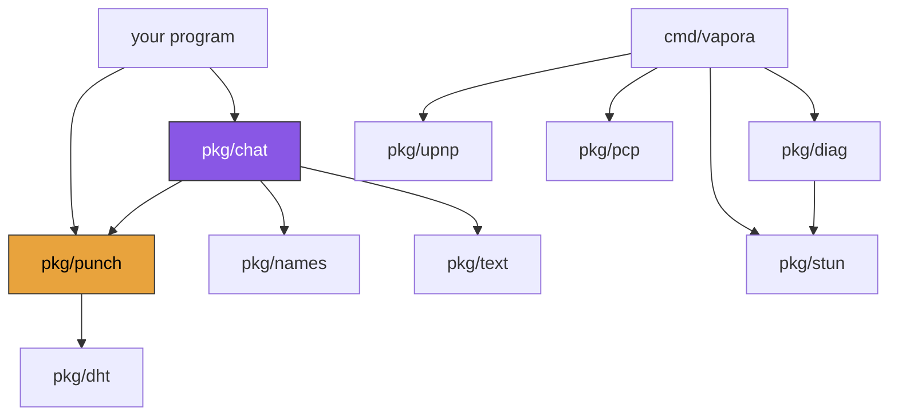

```
█▀▀▀▄ █   █ ▀▀█▀▀ █     █▀▀▀▄ ▀▀█▀▀ █▄  █ ▄▀▀▀▄
█▄▄▄▀ █   █   █   █     █   █   █   █▀▄ █ █  ▄▄
█   █ █   █   █   █     █   █   █   █  ██ █   █
▀▀▀▀   ▀▀▀  ▀▀▀▀▀ ▀▀▀▀▀ ▀▀▀▀  ▀▀▀▀▀ ▀   ▀  ▀▀▀
      ▄▀▀▀▄ █   █   ▀▀█▀▀ █   █ ▀▀█▀▀ ▄▀▀▀▄
      █   █ █▄  █     █   █▄▄▄█   █   █
      █   █ █  ██     █   █   █   █    ▀▀▄
       ▀▀▀  ▀   ▀     ▀   ▀   ▀ ▀▀▀▀▀ ▀▀▀▀
```

**English** · [Español](ARCHITECTURE.es.md)

**How the channel is built, and how to use it for something that is not a chat.**

← [back to the README](README.md)

---

## The shape of it

```
        ┌──────────────────────────────────────────────┐
        │  your program                                │   bytes in, bytes out
        ├──────────────────────────────────────────────┤
        │  pkg/chat        lines · typing · speakers   │   one possible caller
        │  pkg/names       key → "CRIMSON OTTER"       │
        ├──────────────────────────────────────────────┤
        │  pkg/punch       the path · keys · the mesh  │   ← the transport
        ├───────────────┬───────────────┬──────────────┤
        │  pkg/stun     │  pkg/upnp     │  pkg/dht     │   finding your address
        │  where am I   │  pkg/pcp      │  finding you │   and opening doors
        └───────────────┴───────────────┴──────────────┘
                              ↓
                         one UDP socket
```

One socket, one NAT binding, one keepalive. Everything above shares it, which is
why `pkg/punch` never reads it directly — `Mux` does, and hands datagrams out.

**Dependencies:** the standard library. That is the whole list.



`pkg/punch` depends on `pkg/dht` and nothing else. Note what is *not* there:
the transport does not import `pkg/text` or `pkg/names`, because it has no
opinion about what bytes mean.

---

## The problem, in one diagram

Your machine has no address of its own. Your router has one; everything at home
shares it. So the first packet from a stranger arrives at a door with no name on
it, and gets dropped.

```
      you                    the internet                    them
  ┌─────────┐                                            ┌─────────┐
  │ 10.0.0.4│───┐                                    ┌───│10.0.0.9 │
  └─────────┘   │                                    │   └─────────┘
             ┌──▼───┐                            ┌───▼──┐
             │router│  ✗ ──── first packet ────  │router│
             └──┬───┘         dies here          └───┬──┘
        203.0.113.7:41001                    198.51.100.4:52000
```

**The fix:** both sides send *out* at the same moment. Each router sees an
outgoing packet, opens a hole for the reply, and the two holes line up.

```
             ┌──────┐                            ┌──────┐
             │router│ ──── ▶      ◀ ──────────── │router│
             └──────┘   both punch at once       └──────┘
                        ✓ path is now open
```

That "at the same moment" is the whole difficulty, and everything below exists
to arrange it.

---

## Step 1 · Where am I? — `pkg/stun`

You cannot invite anybody anywhere until you know what the world sees.

```go
conn, _ := net.ListenUDP("udp4", &net.UDPAddr{})

watcher := stun.NewWatcher(stun.DefaultServers, stun.DefaultKeepalive)
endpoint, err := watcher.Wait(ctx, 10*time.Second)   // 203.0.113.7:41001
```

`Watcher` keeps asking, so it also notices when your address **changes** —
switch wifi and the invite you shared is dead:

```go
watcher.OnChange(func(was, now *net.UDPAddr) { /* share a new invite */ })
```

It also classifies your router, which decides whether a connection is possible
at all:

| | What it means |
|---|---|
| **Mapping** | Does your address stay the same for every destination? *Endpoint-independent* ("cone") means yes. *Address-dependent* ("symmetric") means nobody can be told where to aim. |
| **Filtering** | Who may send you a first packet? *Endpoint-independent* is open. *Port-dependent* means only people you contacted first. |

```go
report, _ := stun.Probe(ctx, stun.DefaultServers, 4*time.Second)
report.Mapping     // stun.MappingEndpointIndependent
report.Filtering   // stun.FilteringAddressAndPortDependent
```

<sup>RFC 5389 for the query, RFC 5780 for the classification.</sup>

---

## Step 2 · Can these two even meet? — `pkg/diag`

Connectivity is a property of the **pair**. No measurement of one end answers it,
which is why the profile is built to be pasted to somebody else.

```go
mine  := diag.Profile{Mapping: report.Mapping, Filtering: report.Filtering}
mine.Code()                       // "CONE-PORT-18"  ← send this to them

theirs, _ := diag.ParseProfile("CONE-OPEN-64")
advice := diag.Pair(mine, theirs)

advice.Works      // true
advice.Invites    // 1 — or 2 when neither side takes a first packet
advice.Publisher  // "them" — the side that must be the one waiting
```

For a group, every pair at once — and a room can be **partly** broken, which no
two-party answer can express:

```go
mesh := diag.MeshOf([]diag.Member{{Name: "ana", Profile: mine}, ...})
mesh.Closes      // false
mesh.Broken      // [{ana, caro, "both hand out a new port per destination..."}]
mesh.Isolated    // ["caro"] — will sit in what looks like an empty room
mesh.Hosts       // ["ana","beto"] — several is a real answer, not a missing one
```

---

## Step 3 · Ask the router nicely — `pkg/upnp`, `pkg/pcp`

Optional, and it often fails. Routers speak three different languages for "open
a door", rarely agree on which, and many say yes and mean no.

```go
gateway, _ := upnp.Discover(ctx, 3*time.Second)          // SSDP multicast
external, _ := gateway.ExternalIP(ctx)
gateway.AddPortMapping(ctx, "UDP", 41000, 41000, "vapora", time.Hour)

client, _ := pcp.Dial(gatewayIP)                         // netip.Addr
version, _ := client.Detect(ctx)                         // PCP, else NAT-PMP
mapping, _ := client.Map(ctx, pcp.MapRequest{...})
```

Two things worth knowing, both learned the hard way:

- **Publish the endpoint STUN observed, never the one you asked for.** Behind
  double NAT, a UPnP mapping's external port lives on a *private* WAN address
  and is not what a peer on the internet can dial.
- **A mapping lease is not a pinhole.** The lease governs the inner router; the
  outermost NAT still expires its binding on inactivity. The waiting side has to
  keep sending regardless.

---

## Step 4 · Open the path — `pkg/punch`

Four pieces. The first is the only one that reads the socket.

```
  ┌─────────┐  datagram   ┌─────────┐  routed by address   ┌─────────┐
  │  socket │ ──────────▶ │   Mux   │ ───────────────────▶ │ Session │
  └─────────┘             └────┬────┘                      └─────────┘
                               │  no route? try each fallback in order
                               ▼
                    watcher → greeter → sessions → DHT
```

```go
mux := punch.NewMux(conn)
go mux.Run(ctx)                                   // the only ReadFromUDP

mux.Fallback(punch.SinkFunc(watcher.Handle))      // STUN replies
mux.Fallback(session)                             // anything that authenticates
```

**Sessions never read.** They are handed datagrams and they send. That is what
lets one socket carry STUN, seven peers and a DHT client at once.

### The handshake

```
   joiner                                                     inviter
      │                                                          │
      │  ── punch ─────────────────────────────────▶ (dropped)   │   router
      │  ── punch ─────────────────────────────────▶ ✓           │   opens
      │                                                          │
      │  ◀───────────────────────────────────── ack ──           │
      │                                                          │
      ├────────────── path open, both directions ────────────────┤
      │                                                          │
      │  ── ping (padded, variable length) ───────▶              │
      │  ◀────────────────────── pong (padded independently) ──  │   liveness
      │                                                          │
      │  ── data ────────────────────────────────▶               │   your bytes
```

```go
codec, _ := punch.NewSecretCodec(secret, punch.RoleInviter)
session := punch.NewSession(mux, codec, nil)
mux.Fallback(session)

session.Observe(punch.ObserverFunc(func(payload []byte) {
    // exactly the bytes the peer sent. Nothing checked, nothing sanitised:
    // what is safe depends on what you are going to do with them.
}))

go session.Run(ctx)                          // keepalive and liveness
session.Open(ctx, 3*time.Minute)             // punch until the ack lands
session.Send([]byte("anything at all"))
```

**The ping is padded to a variable length**, and the pong pads independently, so
neither is recognisable by size. A silent probe that is obviously a probe is not
a silent probe.

### What the wire looks like

```
  ┌──────────┬─────────────┬──────────────────────────────────┐
  │ nonce    │ kind        │ payload (encrypted, AES-256-GCM) │
  │ 4 + 8 B  │ 1 B         │                                  │
  └──────────┴─────────────┴──────────────────────────────────┘
       │            │
       │            └── < 0x40 : transport's own (punch/ack/ping/pong/bye)
       │                  0x40 : punch.AppKind — yours, never interpreted
       │
       └── 4 random bytes per process + a counter. The prefix identifies the
           sender's codec instance, which is what tells a peer that moved from
           a stranger holding the same invite.
```

**One kind is yours.** If you need several, tag them *inside* the payload — then
the two numbering spaces can never collide:

```go
const (
    tagName byte = 1
    tagPart byte = 2
)
session.Send(append([]byte{tagPart}, chunk...))
```

<sup>See <a href="examples/filedrop">examples/filedrop</a> for the whole pattern in one file.</sup>

---

## Step 5 · More than two — the mesh

A room is **not** a session with more peers. It is every pair at once, each with
its own key, and nobody relays anything.

```
        ANA ─────────────── BETO
          ╲                 ╱
           ╲               ╱          every edge is its own AES-256-GCM
            ╲             ╱           channel, keyed by X25519 between
             ╲           ╱            those two and nobody else
              ╲         ╱
               ╲       ╱
                 CARO
```

### Two layers of key, and only one is trusted

| Layer | Derived from | Seals | Who can open it |
|---|---|---|---|
| **Room key** | the invite's secret | `hello`, `full` | anyone holding the invite |
| **Pair key** | X25519(mine, theirs), salted with the room secret | everything else | only those two |

That is arithmetic, not a promise: a third member does not have the private half,
so it cannot read or forge what two others say. A `hello` sealed with the room
key can announce somebody; it can never speak for them.

**Roles without hierarchy.** In a mesh there is no "who invited whom", so the
direction comes from comparing the two public keys — `bytes.Compare` decides who
seals with `low` and who with `high`. Both sides compute it, neither negotiates.

### Joining

```
  newcomer                    member M                    everyone else
      │                          │                              │
      │ ── hello{my key} ──────▶ │   sealed with the room key    │
      │                          │                              │
      │ ◀── welcome{roster} ──── │   sealed with the PAIR key —  │
      │                          │   an impostor with the        │
      │                          │   invite cannot produce this  │
      │                          │                              │
      │                          │ ── intro{newcomer} ─────────▶ │
      │                          │                              │
      │ ◀═══════ both punch at the same moment ═══════════════▶ │
      │                                                         │
      │ ═══════ direct pair channel, M is not involved ════════▶ │
```

**That simultaneity is the entire job of whoever invites you.** It is also why a
room works on networks where a single invite does not: an established room *is*
the rendezvous.

```go
room, _ := punch.NewRoom(punch.RoomOptions{
    Identity: identity,                       // X25519, generated per process
    Secret:   secret,
    Mux:      mux,
    Local:    punch.LocalAddr(port),          // see below
})

room.Observe(punch.RoomObserverFunc(func(from punch.Member, payload []byte) {
    // from.Key is who. There is no name here on purpose.
}))

room.Join(ctx, invite, 3*time.Minute)
room.Broadcast([]byte("to everyone"))
room.SendTo(key, []byte("to one person, and nobody else can read it"))
```

### Two addresses, not one

A single address cannot describe somebody behind **your own** router: their
public address needs the router to send a packet out and route it straight back
in, which most home routers refuse to do for UDP.

```
   ANA ──▶ router ──▶ ✗ ──▶ back in ──▶ BETO      public address: fails
   ANA ─────────── 192.168.1.9 ───────▶ BETO      local address:  works
```

So every member announces both, and the pair rotates through them until one
answers. Neither replaces the other — a local address is meaningless from
outside that network and is the only thing that works from inside it.

---

## Step 6 · Meeting with no address at all — `pkg/dht`

Opt-in, and it costs something. Both sides announce themselves on the BitTorrent
mainline DHT under a key derived from the shared secret.

```go
key, _ := punch.RendezvousKey(secret)         // HKDF, one way only
meeting, _ := punch.NewRendezvous(mux, secret, port)
mux.Fallback(punch.SinkFunc(meeting.Deliver))

meeting.Publish(ctx, func(peers []*net.UDPAddr) {
    for _, peer := range peers { room.Reach(ctx, peer) }
})
```

**Nothing it returns is trustworthy.** That network has nodes answering every
key with addresses nobody announced — including, observed while building this,
ones that copy the port you just announced. An address from there is a place to
try. Only a frame under the secret makes anybody a participant.

**The honest cost:** your address goes into a public table. Nobody can look you
up without the secret, but you become one more row anyone crawling can see.

---

## Building something that is not a chat

The recipe, in the order the pieces need each other:

```go
// 1. one socket, one mux
conn, _ := net.ListenUDP("udp4", &net.UDPAddr{})
mux := punch.NewMux(conn)
go mux.Run(ctx)

// 2. find your own address
watcher := stun.NewWatcher(stun.DefaultServers, stun.DefaultKeepalive)
mux.Fallback(punch.SinkFunc(watcher.Handle))
go watcher.Run(ctx, conn)
endpoint, _ := watcher.Wait(ctx, 10*time.Second)

// 3. a secret, shared however you like — it is the key, not an address
secret, _ := punch.NewSecret()
codec, _ := punch.NewSecretCodec(secret, punch.RoleInviter)

// 4. a session on top
session := punch.NewSession(mux, codec, nil)
mux.Fallback(session)
session.Observe(punch.ObserverFunc(handle))
go session.Run(ctx)

// 5. punch, then it is just bytes
session.Open(ctx, 3*time.Minute)
session.Send(payload)
```

**Rules the transport will not enforce for you**, because it cannot know what
your bytes mean:

- **Bound your payloads.** A datagram that has to survive a home router should
  stay well under 1200 bytes after the seal.
- **UDP does not promise delivery.** Every frame authenticates and replays are
  rejected, but nothing is retransmitted. If you need ordering or completeness,
  that is yours to add.
- **Validate what arrives before you act on it.** `Observer.Data` hands you the
  peer's bytes unexamined. If they reach a terminal, a filesystem path, or a
  parser, that is where the checking belongs — see how `pkg/chat` refuses
  anything that is not text, and how `examples/filedrop` refuses to trust a
  filename.

---

## Where to read next

| | |
|---|---|
| [`examples/filedrop`](examples/filedrop) | The whole thing in one file, moving a file with no chat |
| [`examples/apitour`](examples/apitour) | Every snippet on this page, in a file the compiler checks |
| [`pkg/chat`](pkg/chat) | A caller worth copying: its own tags, inside the payload |
| [`AGENTS.md`](AGENTS.md) | The invariants — the details that turn out to be load-bearing |
| [`README.md`](README.md) | What it is for, if you got here first |

---

<sup>Go 1.25, standard library only. <code>go test ./... -race</code></sup>
